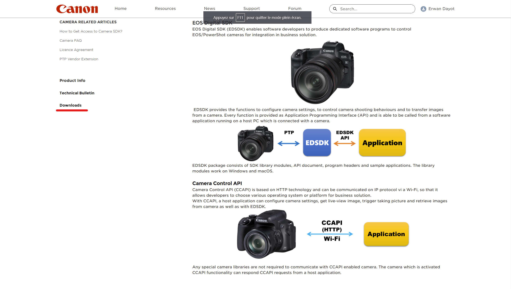

# Canon - Camera Control API


## Simple method to easily use Canon "Camera Control API" in python.


### Installation

Unfortunatly I can't explain the real installation the files used are licensed. All you need to know is that you had to join the canon develloper program at :

https://developers.canon-europe.com/s/article/How-to-get-access-camera

Where all is explained.

This might take a week to register and had access to this download button at https://developers.canon-europe.com/s/camera (you had to be connected and register at the program): 



Click on the button and you are going to be on the download page and simply download the last version of CCAPI.

And for the rest follow the instructions on : ``Document/CameraControlAPI_OperationGuide_EN.pdf``
 
And it's done.

### Use

Warning : I have a Canon EOS 250D and some parts of the API are just unvailabe for and I can't develop them.

Don't forget that this reposities is based on a http web api.

All it does is shortcuts to the real http based api.

Most of methods had a get() and post or put object. Basically function.get() will return json object :

```
{
    "value":"100",
    "abilities":[
        "100","200","300"
    ]
}
```

and post/put method post only the ``value``, and to not had a error this value must be in ``abilites``.

Some of them are more complicated and refering to the documentation is neccesary to understand what the ccapi does.

The reposities also had some usefull build-in function like ``Camera.functions.datetime.sync()`` to sync datetime or ``Camera.contents.get_chunked(path)`` to get directly the json object of all image in the folder and not just paged ones

